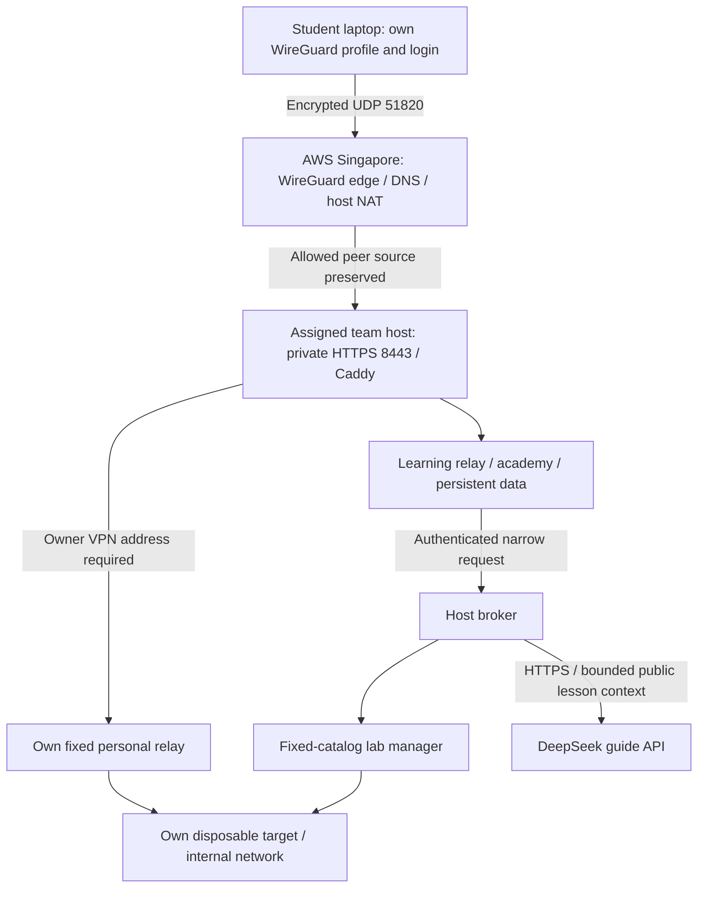

# Outsiders Security Academy — VPN access and demo guide

**Prepared 5 September 2026. Share this guide with the group and lecturer. Send each student's private access kit separately to its owner.**

This is a private, student-built Software Security academy on AWS Singapore. It provides a 19-week learning journey, personal web targets and a source-linked AI guide. The original course authors retain credit and the lecturer controls assessment. The deployment was verified on 5 September; this document is not a live uptime monitor.

## 1. What to send

Send everyone this guide and the [full semester and verification report](OUTSIDERS-RELEASE.md). A link to an internal lab alone does not grant access. Each enrolled student also needs an individual kit containing:

| File | Purpose | Delivery |
|---|---|---|
| `START-HERE.md` | Own team, setup instructions and public CA fingerprint | Only the owner needs their copy |
| `outsiders.conf` | Ready-to-import WireGuard tunnel, including a private key | Private; never share with another person/device |
| `account.json` | Exact student ID, individual password and login URL | Private; never include in group messages or recordings |
| `course-root.crt` | Public course CA certificate for that team | Public certificate, but verify its fingerprint with the organizer |

The shareable guide contains no passwords, VPN private keys or AI key. The organizer retains a separate private delivery index. Do not send the entire workspace, all student folders, Terraform state, `.env` files, operator SSH material or an instructor VPN profile to the group. A ZIP is packaging, not encryption: deliver each private kit through an appropriate private channel.

There are **five enrolled student accounts: three on Team 1, two on Team 2**. The lecturer has no separately issued demo credential in this release. A screen-shared demonstration using an enrolled student's own device works immediately. Independent lecturer access needs a separately provisioned VPN identity and, for a personal target, a practice account/slot. The operator's instructor tunnel also permits private administration and must not be treated as a general viewing invitation.

## 2. Live URLs

Use the team in your private `account.json`. Keep **https** and **:8443** in every address.

| Page | Team 1 | Team 2 |
|---|---|---|
| Academy entrance | [Open academy](https://learn.team1.labs.test:8443/campus) | [Open academy](https://learn.team2.labs.test:8443/campus) |
| Student sign-in | [Sign in](https://learn.team1.labs.test:8443/campus/login) | [Sign in](https://learn.team2.labs.test:8443/campus/login) |
| My workspace | [Personal workspace](https://learn.team1.labs.test:8443/campus/dashboard) | [Personal workspace](https://learn.team2.labs.test:8443/campus/dashboard) |
| Infrastructure / cost / demo | [Explore infrastructure](https://learn.team1.labs.test:8443/campus/architecture) | [Explore infrastructure](https://learn.team2.labs.test:8443/campus/architecture) |
| First learning room | [Week 1](https://learn.team1.labs.test:8443/campus/week/1) | [Week 1](https://learn.team2.labs.test:8443/campus/week/1) |
| API learning room | [Week 10](https://learn.team1.labs.test:8443/campus/week/10) | [Week 10](https://learn.team2.labs.test:8443/campus/week/10) |
| Full semester companion | [Journey](https://learn.team1.labs.test:8443/learn/software-security/journey) | [Journey](https://learn.team2.labs.test:8443/learn/software-security/journey) |

Weeks 1–19 use `/campus/week/1` through `/campus/week/19`. Personal target URLs appear in **My workspace** after launch. They follow `https://pS.teamT.labs.test:8443`, where the slot and team come from your account. Do not substitute another person's slot. Targets can be stopped, so bookmarking a target does not keep it running.

These `.labs.test` names use private DNS. They are not public websites and cannot be opened through an ordinary internet connection alone. Do not replace the hostname with the EC2 IP: hostname routing and TLS depend on the name.

## 3. First-time setup: Windows and macOS

Allow roughly 10 minutes, including the first certificate setup.

1. Receive your own private kit and extract it into a private folder. Read `START-HERE.md`; open `account.json` locally when you need the login details.
2. Install the official [WireGuard client](https://www.wireguard.com/install/) for your operating system. The Windows installer and macOS App Store link are listed there.
3. Open WireGuard. Choose **Import tunnel(s) from file** or the equivalent import option, then select your `outsiders.conf`. Do not edit its keys, address, DNS or routes.
4. Activate the imported tunnel. Approve the normal OS VPN setup prompt if shown. After opening the academy, WireGuard should show a recent handshake and received traffic. An “active” switch alone does not establish that the server replied.
5. Trust your team's course CA in a dedicated course browser profile, as described below.
6. Open the sign-in URL from `account.json`, enter your exact student ID and its individual password, then open **My workspace**.

Use one copy of a VPN profile on one device at a time. The tunnel is tied to that learner's assigned address. A friend’s VPN with your password will not work. Existing VPNs or networks with overlapping routes may need your administrator's help; do not disable institutional security controls to work around a conflict.

### Trust the private HTTPS certificate

The VPN controls network access. The course CA lets the browser verify the private HTTPS server. These are two different steps. Each team has its own CA.

For a contained course setup, use a dedicated Firefox profile and import the supplied root into that profile:

1. In Firefox **Settings → Privacy & Security → Certificates → View Certificates**, select **Authorities → Import**.
2. Select your supplied `course-root.crt`. Check its SHA-256 certificate fingerprint against `START-HERE.md` and confirm it through your organizer's trusted channel if uncertain.
3. Enable trust for identifying websites, finish the import and reload your team academy.
4. Confirm the address is the assigned `learn.teamN.labs.test:8443` and the browser has no certificate error. Do not click through a certificate warning.

Menu wording can vary. Mozilla documents [manual root import](https://wiki.mozilla.org/CA/Changing_Trust_Settings) and [private CA configuration](https://support.mozilla.org/en-US/kb/setting-certificate-authorities-firefox). For a managed device, ask IT to apply the appropriate browser policy. Safari and Chromium-based browsers may use platform certificate stores; [Apple's trust settings](https://support.apple.com/guide/keychain-access/change-the-trust-settings-of-a-certificate-kyca11871/mac) and [Windows root-store documentation](https://learn.microsoft.com/en-us/windows-hardware/drivers/install/trusted-root-certification-authorities-certificate-store) cover that wider trust scope. Prefer the dedicated course profile where supported.

If OpenSSL is installed, compare the certificate fingerprint with:

```sh
openssl x509 -in course-root.crt -noout -sha256 -fingerprint
```

This fingerprints the certificate, not the raw file bytes. Remove only this course CA from the course profile when the course access is retired; leave unrelated trust settings unchanged.

## 4. Linux access

Install WireGuard using the [official distribution instructions](https://www.wireguard.com/install/). For a desktop environment, importing the supplied configuration with its supported VPN manager is convenient. For `wg-quick`, open a terminal in your private kit directory:

```sh
chmod 600 outsiders.conf
sudo wg-quick up ./outsiders.conf
sudo wg show
```

The profile includes `DNS = 10.66.0.1`. `wg-quick` needs a working `resolvconf`-compatible resolver helper for that field. If it reports a resolver-helper error, complete your distribution's DNS integration or use its supported desktop VPN manager; do not simply discard the DNS setting. Configure the browser's course CA as above. Disconnect after the session with:

```sh
sudo wg-quick down ./outsiders.conf
```

The [WireGuard quick start](https://www.wireguard.com/quickstart/) explains the command-line tools. A laptop or desktop is the supported demonstration format; packet tools and local compiler exercises are easier there than on a phone.

## 5. Confirm access in three stages

**Tunnel:** activate your own profile, open a lab URL and check for a recent handshake. The configured endpoint is `52.77.72.96:51820/UDP`. It is a VPN endpoint, not a browser URL.

**Private DNS:** on Windows, macOS or Linux with `nslookup`, query your assigned team:

```sh
nslookup learn.team1.labs.test 10.66.0.1
```

Expected Team 1 address: `10.60.10.10`. Team 2 uses `learn.team2.labs.test` and `10.60.20.10`. Private DNS for both learning and personal hostnames was checked during rollout. Browser secure-DNS settings may require an administrator-approved exception for the internal names if they bypass the VPN resolver.

**HTTPS:** from the private kit folder, use the appropriate team URL:

```sh
curl --cacert course-root.crt --connect-timeout 10 -I https://learn.team1.labs.test:8443/campus
```

On Windows PowerShell use `curl.exe` to select the actual curl executable. An HTTP 200 response verifies the academy endpoint; this does not log you in. Browser CA configuration and curl's explicit `--cacert` are independent. Do not use `-k` or `--insecure`.

Students can reach their assigned team’s web gateway. The other team is intentionally unreachable. Even within a team, another student's personal hostname returns 403. The VPN routes the lab ranges `10.60.0.0/16` and `10.66.0.0/24`; ordinary internet traffic is not configured as a full-tunnel VPN. DNS may still use the VPN resolver while connected.

## 6. Use a personal lab

1. Sign in and open **My workspace**. Choose the target matching the lesson.
2. Click **Start my lab** and wait briefly for startup. Open the target URL shown on the page.
3. Make a normal request first. Then change one input, observe the result and keep evidence in your project notes.
4. Save evidence before stopping. Use **Stop my lab and discard its changes** to reset, then start again for fresh demo data. Stop the current target before choosing a different version.
5. A target expires 60 minutes after launch, even if you are still working. It may take the reaper's next 30-second pass to remove it. Course accounts, progress and persistent coursework are separate from target data.
6. Open the matching weekly room for explanations, step/play diagrams, six-slide view and resources. Ask Scout a focused question and follow its source links.

| Target choice | Lesson | Actual runtime |
|---|---|---|
| Threat / notes | Week 1 | Personal notes application |
| Injection | Week 4 | Deliberately vulnerable injection application |
| XSS | Week 5 | Deliberately vulnerable browser/input application |
| Authentication / authorization | Week 6 | Personal auth practice application |
| API: vulnerable or defended | Week 10 | Two selectable API implementations |
| AI: vulnerable or guarded | Week 14 | Two selectable deterministic chatbot implementations |
| DevSecOps: insecure or defended | Week 15 | Two selectable service implementations |
| NoteVault project | Week 16 / integration | Disposable personal project starter |

There are eleven choices in total, with one active target per person. These are real web services. Browser diagrams remain explanatory models; compilers, fuzzers, scanners, registry signing and CI exercises use the learner's local toolbox/VM or owned repository. There is no unrestricted hosted shell or kernel-exploitation target. Practice accounts do not replace the lecturer's existing assessment codes.

Scout is a real DeepSeek-backed guide, whereas the Week 14 target is a deterministic teaching model. Scout sends the question and selected lesson excerpts to DeepSeek; do not paste credentials, private records or graded answers. It cannot run commands, reset targets, see grades or submit work. This platform retains usage counters but not chat text. Answers can be wrong: verify their cited sources. Limits are 30 questions per learner per day and one provider request at a time per team, with source-based fallback when unavailable.

## 7. Infrastructure explained



| Layer | Current setup | Purpose |
|---|---|---|
| AWS region | Singapore, `ap-southeast-1` | Short regional path for the cohort |
| VPC | `10.60.0.0/16`, one availability zone | Dedicated teaching network; low-cost single-AZ pilot |
| Edge subnet | `10.60.0.0/24` | WireGuard/NAT edge at `10.60.0.10` |
| Edge compute | One `t3.micro`, public endpoint `52.77.72.96` | Public UDP 51820 only; no public lab web/SSH listener |
| Tunnel / DNS | `10.66.0.0/24`; DNS/server `10.66.0.1` | One cryptographic VPN identity and assigned /32 per device |
| Team 1 | `10.60.10.0/24`; host `10.60.10.10`; `t3.small` | Three learner slots; private HTTPS |
| Team 2 | `10.60.20.0/24`; host `10.60.20.10`; `t3.small` | Two learner slots; private HTTPS |
| Storage | 24 GiB encrypted gp3 per host, 72 GiB total | OS/images plus persistent academy databases, uploads and CA volumes |
| HTTPS | Caddy internal CA per team, port 8443 | Private hostname routing and server identity |
| Academy | Flask learning application, fixed relay, SQLite | Lessons, separate practice accounts/progress and existing coursework |
| Personal networks | `172.31.1.0/24`, `.2.0/24`, `.3.0/24` as assigned on each host | One target and fixed relay per slot; separate host-local bridges |
| Lab manager | Restricted systemd host service and reviewed image catalog | Start/status/stop and 60-minute expiry |
| AI | DeepSeek V4 Flash through the host broker | Source-linked, tool-free guidance |

The reusable definitions are Terraform for AWS, cloud-init for host bootstrap, Compose for persistent services, and the personal-lab scripts for the reviewed runtime. Private input enrollment follows infrastructure creation. Keys and rosters are supplied outside Git/state. The current release is reproducible from the source plus those private inputs; it is not an anonymous one-click public registration service.

The edge doubles as the NAT instance for trusted host dependency updates and guide HTTPS requests. The deliberately vulnerable target networks cannot use that path. No NAT Gateway, load balancer or additional EC2 instance was added for the personal labs. One edge is a single point of failure; this pilot does not claim high availability.

The gateway preserves/checks the real VPN peer and overwrites the application's trusted peer header. The application also binds each practice session to its assigned VPN address. Each target has non-root UID 10001, a read-only root, no capabilities or host ports, a 160-MiB memory limit, 0.5 CPU and 64 PIDs. A 64-MiB temporary filesystem holds disposable writes. A fixed relay connects only its own target network and trusted ingress. Target requests to the host, metadata, other slots and the internet are denied. Containers share a kernel, so this isolation is for the planted application exercises.

At idle, Team 1 has six service containers and Team 2 has five, plus one host broker on each. Five concurrent students add five target containers. The 1424-MiB and 1232-MiB declared service ceilings leave headroom on the roughly 1906-MiB hosts. These are ceilings rather than throughput promises. T3 uses standard CPU credits; sustained heavy work may throttle.

## 8. Cost and validation

At the checked 5 September 2026 Singapore rates, a 730-hour month is approximately **$58.74 AWS**: $48.18 compute + $6.912 gp3 + $3.65 public IPv4. Scout reserves at most another **$10/month across both hosts** for this application's configured requests. This excludes tax, snapshots/backups and chargeable traffic; it is an estimate, not an invoice. See the [calculation and pricing sources](OUTSIDERS-RELEASE.md#cost-and-operations).

Keeping the edge on while running each team host for 176 hours would be approximately $29.49 before AI/exclusions. That is a scenario, not an active schedule. Stopped instances still retain billed storage and the allocated IPv4 remains billable.

The release passed **798 automated tests** with one existing skip. All eleven target types ran on both AWS hosts. All five student profiles reached their own accounts and targets. Cross-student and cross-team checks, forged-header and cookie-replay checks, outbound denials, independent reset and expiry-after-restart checks passed. Both hosts served 88 linked resources successfully. A bounded five-client test completed 150/150 target requests with per-client medians near 0.16 seconds. This is functional release evidence, not a sustained performance guarantee. Read [the full verification report](OUTSIDERS-RELEASE.md).

## 9. A 15-minute lecturer demonstration

| Time | Demonstration | Evidence to show |
|---|---|---|
| 0–2 min | Academy overview and all 19 rooms | Beginner-to-advanced path, lecture attribution and weekly resources |
| 2–4 min | Week 10 visual flow and six-slide explanation | Predict an authorization decision before running a request |
| 4–7 min | Personal vulnerable API | Normal baseline, changed object ID, observed response |
| 7–9 min | Stop and start defended API | Missing identity denied, wrong owner denied, allowed owner succeeds |
| 9–11 min | Two students on their own devices | Independent target data; another student's hostname denied |
| 11–13 min | Ask Scout and open a citation | Explain the mechanism and the toy identity limitation |
| 13–15 min | Infrastructure/cost explorer | Private request path, IaC, expiry, measured tests and cost tradeoff |

For the Week 10 comparison, use the URL actually shown in your own workspace. With your target base in place of `YOUR_OWN_TARGET_URL`, a browser or API client can request `/api/users/2/orders`. The vulnerable API returns orders without an ownership check. On the defended target, no identity returns 401, `X-User-Id: 1` returns 403, and `X-User-Id: 2` returns 200. This header is deliberately forgeable and is not production authentication. Explain that limitation rather than claiming the demo solves impersonation.

If curl is installed, an enrolled Team 1 slot-1 student can use the following against their **currently running API target**, from their kit directory. Other students must replace the hostname with their own workspace URL:

```sh
curl --cacert course-root.crt -i https://p1.team1.labs.test:8443/api/users/2/orders
curl --cacert course-root.crt -i -H 'X-User-Id: 1' https://p1.team1.labs.test:8443/api/users/2/orders
curl --cacert course-root.crt -i -H 'X-User-Id: 2' https://p1.team1.labs.test:8443/api/users/2/orders
```

Use `curl.exe` on Windows PowerShell. The CA flag is for server verification; the `X-User-Id` values are seeded fictional lab users, not student IDs. Keep the student's academy password, VPN profile contents, API key and real graded submissions out of the recording. Screen-sharing the already connected student's browser does not require giving the lecturer that student's credentials.

## 10. Troubleshooting

| Symptom | Likely cause / next check |
|---|---|
| WireGuard says active but no received traffic | Generate traffic by opening the academy; check recent handshake, correct profile, internet connectivity and UDP 51820 availability. Contact the organizer if the endpoint is unreachable. |
| `DNS_PROBE_FINISHED_NXDOMAIN` / cannot resolve | Connect the tunnel; query `10.66.0.1` explicitly; check VPN DNS installation and whether browser secure DNS bypasses internal resolution. |
| HTTPS timeout | Verify own team, port 8443, handshake and private DNS. The other team is deliberately denied. The organizer can check whether the host is running. |
| Certificate issuer error | Wrong team's CA or missing trust in the browser actually being used. Compare the fingerprint and import the correct supplied CA. |
| Certificate name mismatch | Use the exact `.labs.test` hostname, not an IP or a different port/domain. |
| Login stays on the sign-in page | Exact ID/password or assigned VPN mismatch. Do not use another person's profile. |
| Login returns 429 | Eight failed/admitted attempts can reach the 15-minute login window limit; pause before retrying. |
| Target returns 403 | You opened another student's personal hostname or used a different assigned VPN. |
| Target returns 502 / unavailable | The target may be stopped, expired or still starting. Open My workspace, refresh status and start your own target. Save evidence before deliberately resetting. |
| Target cannot reach internet or another slot | Expected lab isolation. Run external scanners/dependency tools in the local toolbox rather than inside the target. |
| Scout is busy / shows sources only | Another question is in flight, quota reached or provider unavailable. Continue with linked resources and retry later. |
| Problems only with another VPN active | Routing/DNS conflict. Ask the network administrator about the dedicated `10.60.0.0/16` and `10.66.0.0/24` routes. |

When reporting a problem, give the organizer your team, the non-secret page URL, time, OS/browser, HTTP status/error text and whether the tunnel has a recent handshake. Do not attach VPN configs, passwords, cookies, keys or full environment dumps.

## 11. Organizer handover and reproducibility

The group's guide and public source/report may be shared. Keep actual access kits owner-specific. The operator uses the [personal deployment runbook](../../deploy/personal-labs/README.md), which supersedes the old shared-target operating procedure. For fresh infrastructure, start with [the AWS IaC documentation](../../infra/aws-vpn-labs/README.md), then apply the personal runtime procedure and privately enroll learners. Do not run Terraform apply merely to let an existing student connect.

Current application operations use `/etc/outsiders/compose.json` on each private host. Starting the old full Compose manifest can recreate retired shared targets and exceed the intended footprint. Backups of the learning/CA volumes and previous image IDs were retained before cutover. Secrets are not included in this guide or the shareable archive.

Useful read-only checks for the authorized operator over private SSH:

```sh
sudo systemctl is-active outsiders-broker
sudo docker compose -f /etc/outsiders/compose.json ps
sudo docker stats --no-stream
free -m
```

Do not print the resolved Compose configuration: it contains runtime secrets. Revocation requires disabling the exact practice account, stopping its slot and revoking its unique VPN peer. New lecturer/guest access must be separately enrolled; sharing a privileged instructor tunnel or a student's profile is not an enrollment method.
