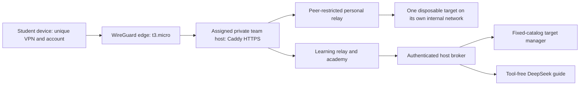

# Outsiders academy — deployed release, 5 September 2026

The private AWS pilot now serves all 19 weeks and gives five learners their own on-demand practice target. This release supersedes the earlier content-only rollout: later-semester web targets are now available remotely through the personal workspace. The independent `deploy/semester-labs` stack remains an optional local environment; it is not running alongside the AWS service set.

Open [Team 1 academy](https://learn.team1.labs.test:8443/campus) or [Team 2 academy](https://learn.team2.labs.test:8443/campus) using the assigned WireGuard profile and trusted course CA. **My workspace** uses the student's exact ID plus their individual password. A different student's VPN cannot use that account or target. Names, IDs, passwords and client VPN keys are deliberately absent from this public release record.

## What learners get

- An original Outsiders SVG mark, dark forest and cream theme, responsive layout and reduced-motion support.
- Nineteen learning rooms, each with a worked example, misconception, practical investigation, advanced question, step/play visual flow and a six-slide explanation: **114 browser slides** in total.
- The earlier beginner/intermediate/advanced semester journey, **44 original retrieval questions**, prerequisite links, 15-minute and 45-minute study paths, and existing interactive simulations.
- **57 account-specific self-reported checkpoints**, separate from grades. The earlier browser-local journey remains available too.
- Eleven real web target choices, one disposable target per learner, start/status/stop controls and a 60-minute lease measured from launch. Reset discards only that target's changes.
- Scout, a visible AI guide powered by a real DeepSeek model, with server-selected course citations. The guide cannot execute commands, change labs, access grades or submit work.
- An [infrastructure and cost explorer](https://learn.team1.labs.test:8443/campus/architecture), including a six-step lecturer demonstration.

The source crawl covered 58 public student-document URLs across the semester; the additional primary-reference check covered 15 sources. Both inventories are checked in. These are supporting resources, not a replacement for the lecturer's assessment requirements.

## Every week: concept, evidence and practice

Every numbered room is `/campus/week/N` on the student's team domain. Each room links its canonical lecture and worksheet and, where applicable, supporting lesson/code documents and a simulation. The table identifies actual practice delivery rather than implying that every week needs another remote server.

| Week | Theory and code reasoning | Practice and evidence |
|---|---|---|
| 1 | Assets, trust boundaries, STRIDE and data flow | Personal notes/threat target; diagram a boundary and justify a mitigation |
| 2 | Secure development, scanner findings and triage | Local toolchain/scanners; reproduce a finding and distinguish evidence from a tool label |
| 3 | Encryption, hashing, MACs, KDFs and key handling | Browser models plus local crypto/code exercises; choose a primitive for the actual job |
| 4 | SQL and command injection; data crossing into syntax | Personal injection target; compare a changed input with parameterized or structured execution |
| 5 | XSS, browser execution contexts and output encoding | Personal XSS target and simulation; trace input to the browser sink |
| 6 | Authentication, sessions and per-object authorization | Personal auth target; compare legitimate and unauthorized object access |
| 7 | First-half review and misconceptions | Published mock practice and retrieval; categorize failed assumptions and reattempt |
| 8 | Written midterm reasoning | Published preparation and self-explanation; lecturer controls assessment |
| 9 | Disciplined practical investigation | Published sandbox/CTF preparation; retain requests, observations and scope evidence |
| 10 | API objects, fields and resource controls | Personal vulnerable/defended API choices; test 401/403/200 and privileged-field binding |
| 11 | Stack/heap layout, lifetime, bounds and ownership | Local toolbox/VM compiler and fuzzer; native ownership/allocation workshop with 15 verified checks |
| 12 | Dependency resolution, SBOMs, artifact identity and signing | Resolver model, local scanning and digest/signer-scoped verification; real registry/OIDC work needs learner-owned setup |
| 13 | IAM, network policy, containers and IaC authority | Local configuration review/scanning plus observation of this private infrastructure's boundaries |
| 14 | Prompt injection, untrusted output and tool policy | Personal vulnerable/guarded deterministic chatbot choices; distinguish the mock from the real Scout service |
| 15 | CI gates, fail-closed behavior, releases and logging | Personal insecure/defended service choices; deny anonymous/non-admin requests and preserve legitimate admin access |
| 16 | Capstone integration and security storytelling | Personal NoteVault practice, project source, evidence and repair rehearsal |
| 17 | Final review across the modern stack | Published mock and original retrieval/design prompts; compare coverage with the actual final blueprint |
| 18 | Security design under constraints | Written final preparation and defensible tradeoffs; lecturer controls assessment |
| 19 | Practical demonstration and project handover | Published final/CTF preparation, recording/Q&A requirements, reproducible evidence and handover |

Web practice is available now; local compilers, fuzzers, scanners, signing and CI exercises intentionally run in each learner's toolbox/VM or owned repository. There is no unrestricted browser terminal, remote kernel-exploitation environment, new private package registry or hosted CI runner. The original assessment and one-time-code workflow remains separate from personal practice accounts.

## Infrastructure and a request's path

Terraform defines the VPC, subnets, routing, security groups, edge and two private team hosts. Compose defines the persistent learning/gateway services and fixed relays. A systemd host broker selects only reviewed image IDs and fixed Docker settings. A browser request cannot choose a Docker command, mount or network.

One t3.micro edge exposes WireGuard UDP 51820. The two t3.small team hosts have no public IP. Caddy serves private HTTPS on 8443; the original private CA and learning volumes are preserved. The five learners occupy three slots on Team 1 and two on Team 2. Direct VPN source checks protect personal hostnames; application sessions also require the account's assigned peer. Forged forwarding headers do not replace that source.

Each target uses a single internal network, a fixed upstream relay, non-root UID 10001, a read-only root, dropped capabilities, no host ports, a 160-MiB memory ceiling, 0.5 CPU and 64 PIDs. Its temporary filesystem is disposable. Target-to-host, metadata, other-target and external access is denied. Containers still share the team host kernel: these controls support the planted application exercises, not unrestricted hostile kernel code.

At idle the hosts retain six and five service containers respectively, plus the host broker. Five active learners add only five target containers across the pilot. The original ten disposable shared target/relay containers on each host were removed. No extra EC2 instances, NAT Gateway or load balancer were introduced.

## Scout: real assistance with bounded authority

Scout uses `deepseek-v4-flash` in non-thinking mode. The provider key stays in a root-only host file and never enters the browser, learning image, Git or Terraform state. The learning service gets a separate broker token. The model receives a bounded question and selected public lesson excerpts; it has no tools and receives no roster, grades, instructor keys or uploaded evidence.

The server validates source IDs and supplies the actual source links. Model text is rendered as text, not executable HTML. Rate/spend counters persist, while this platform does not save chat text. Questions are sent to DeepSeek, and its data handling applies. Learners should not paste private information. Source grounding improves reviewability; it does not guarantee factual correctness. Real testing caught misleading Week 10 phrasing, so current-runtime instructions and a reviewed fallback explicitly explain the forgeable teaching identity header.

Each host reserves at most $5/month and $1/day for this application's guide calls; each learner has a 30-question daily limit. One provider request runs at a time per host. Source-based fallback remains available when the provider or budget is unavailable. The combined $10 monthly application allowance is conservative reservation accounting, not the provider invoice or a cap on other uses of the same API key. There is no automatic top-up.

## Measured verification

The machine-readable evidence is [outsiders-release.json](verification/outsiders-release.json). Tested runtime code: `f4b6102` (learning UI content unchanged since `8c287bf`; subsequent code fixes affected host deployment/target builds and Docker status handling).

- **798 automated tests passed**, one existing test skipped. An existing Eventlet deprecation warning remains.
- All eleven target types launched and returned healthy HTTP responses on **both AWS hosts**, over actual student VPNs with normal CA and hostname verification.
- **88 linked resources per host** returned HTTP 200: canonical pages, simulations and academy assets. All 19 learning rooms were also checked through each of the five student profiles.
- Real own-account login and own-target access succeeded for all five. Cross-student hostnames returned 403, wrong-peer login and session-cookie replay were denied, and cross-team TCP access failed. Forged peer/forwarding headers did not bypass those checks.
- API 401/403/200 behavior and privileged-field binding differed as expected; guarded chatbot output escaped HTML; fail-closed service denied anonymous/non-admin requests and allowed its seeded demo admin.
- Five independent target data stores were exercised. Resetting slot 1 with a forged slot 2 request field reset only slot 1; the other students' created data survived.
- An expired lease was injected into persisted state while the broker was stopped on each host. Restart removed only the expired target and retained unexpired targets. This tests expiry reconciliation without waiting an hour.
- Every active target's container controls were inspected. Actual target-origin probes to Internet, external DNS, metadata, the host broker, host SSH and another slot all failed.
- Five VPN clients each issued 30 target requests concurrently: **150/150 succeeded**. Median round trips per client were 0.156–0.162 seconds; the slowest request was 1.221 seconds. This is a bounded functional smoke, not a sustained load benchmark.
- The post-smoke snapshot showed 1117 MiB and 1160 MiB available host memory. No tested target was OOM-killed. Heavy fuzzing/scanning remains local; T3 CPU credits can throttle sustained work.
- Actual DeepSeek requests returned source-linked answers on both hosts; reviewed fallback was also observed. Unit checks cover durable quota rejection and safe rendering.
- Browser checks verified the Outsiders theme/logo, responsive layout, step/slide controls and live cost calculation: changing 730 hours to 176 changed the displayed AWS estimate from $58.74 to $29.49.

Consistent learning/CA backups were taken before cutover. The deployment guide documents rollback using the retained prior image IDs and volume archives. Student test targets are stopped after verification, and temporary VPN verification clients are removed; actual student peers remain enrolled.

## Cost and operations

At the checked Singapore list rates and a 730-hour month: compute $48.18 + 72 GiB gp3 $6.912 + one public IPv4 $3.65 = **approximately $58.74/month**. The guide's application budget adds at most $10/month in reserved requests. Exclusions are tax, snapshots/backups and chargeable traffic. This is a planning estimate, not an invoice.

Running both team hosts for 176 hours while keeping the edge on would be about **$29.49/month before AI and exclusions**. No stop/start schedule was activated; the calculator is an educational model. Storage and the allocated IPv4 remain billable when compute is stopped. [AWS EC2 pricing](https://aws.amazon.com/ec2/pricing/on-demand/), [EBS pricing](https://aws.amazon.com/ebs/pricing/), [IPv4 pricing](https://aws.amazon.com/vpc/pricing/), [DeepSeek pricing](https://api-docs.deepseek.com/quick_start/pricing/).

Use [the personal deployment/operator guide](../../deploy/personal-labs/README.md) for install, private inputs, account reset/revocation, guard refresh and rollback. Operate the live service set with `/etc/outsiders/compose.json`; the old full manifest can recreate retired shared targets and exceed the intended footprint. Fresh Terraform provisioning is followed by the private-input enrollment/install procedure; secrets are not embedded into bootstrap state.

## Suggested lecturer demonstration

1. Explain Week 10 using the flow and six-slide view; state the prediction before opening a target.
2. Launch the personal vulnerable API and demonstrate a normal request, an object-ownership failure and privileged-field binding using ungraded demo data.
3. Show a second learner's independent state and denial when that peer opens the first learner's hostname.
4. Start the defended counterpart; demonstrate denial and legitimate access. Explain why its toy `X-User-Id` still needs verified identity in a real system.
5. Ask Scout for an explanation, open its source, and distinguish the real guide from Week 14's deterministic lab model.
6. Open the architecture/cost explorer and show the IaC, verification record, cost tradeoff and rollback procedure. Keep onboarding credentials and operator consoles with secrets out of the recording.
